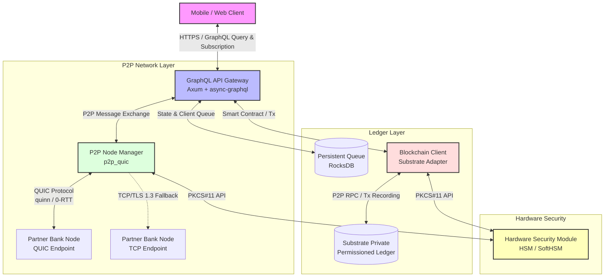

# NDID High-Performance Blockchain Banking System (Rust)

ระบบ National Digital ID (NDID) ความเร็วสูงบนบล็อกเชนสำหรับธนาคารพาณิชย์ไทย (High-Performance Blockchain Banking System) เพื่อรองรับการแลกเปลี่ยนข้อมูล KYC และการทำธุรกรรมข้ามธนาคารได้อย่างรวดเร็ว มั่นคงปลอดภัย และมีเสถียรภาพสูง

---

## 🏗️ System Architecture

ระบบแบ่งการทำงานออกเป็น 3 เลเยอร์หลัก: **API Gateway**, **P2P Networking**, และ **Blockchain Integration Layer**



---

## ✨ Key Features

1. **GraphQL API Gateway over Axum**
   - รองรับ GraphQL Queries, Mutations และ Subscriptions เพื่อตรวจสอบข้อมูลและสร้างรายการยืนยันตัวตน (KYC) แบบ Real-time
   - ทำงานร่วมกับ `Tower` Middleware สำหรับการทำ Rate Limiting (1,000 requests/sec) และ Buffering

2. **High-Speed P2P Network (QUIC & TCP/TLS Fallback)**
   - ใช้โปรโตคอล **QUIC (quinn)** ในการส่งถ่ายข้อมูล KYC ข้ามธนาคารด้วยความเร็วสูง รองรับการเชื่อมต่อแบบ 0-RTT
   - ระบบ **Auto-Fallback** ไปยัง **TCP + TLS 1.3 (tokio-rustls)** โดยอัตโนมัติหากเครือข่ายบล็อกพอร์ต QUIC (UDP)

3. **Persistent Transaction Queue (RocksDB)**
   - ใช้ **RocksDB** ในการเก็บคิวธุรกรรมที่มีประสิทธิภาพสูงบน Disk แทน Memory
   - มีระบบ **Background Retry Worker** คอยส่งธุรกรรมที่ค้างคาไปยังบล็อกเชน Substrate เมื่อเครือข่ายกลับมาทำงานปกติ

4. **Security-First Implementations**
   - การลงนามธุรกรรมด้วย **ED25519 (ed25519-dalek)**
   - การเข้ารหัสข้อมูลอ่อนไหวด้วย **AES-256-GCM (aes-gcm)**
   - ป้องกันข้อมูล PII รั่วไหลด้วยการทำ SHA-256 Hashing และการทำ Memory Sanitization ด้วย `Zeroize` / `secrecy`
   - รองรับการเชื่อมต่อกับ **Hardware Security Module (HSM)** ผ่าน PKCS#11 API (เป็นฟีเจอร์เลือกใช้งานเสริม)

---

## 📂 Project Structure

```text
banksystemrust/
├── Cargo.toml               # โครงสร้าง Dependency และการตั้งค่าโปรเจกต์ Rust
├── README.md                # คู่มือการใช้งานระบบ
├── AGENTS.md                # กฎและ Coding Conventions สำหรับ AI
├── SKILL.md                 # รายละเอียดทักษะการพัฒนาโปรเจกต์
├── run.sh                   # สคริปต์ควบคุมการทำงาน (Run, Build, Test, Check)
├── config/
│   └── default.toml         # ไฟล์ตั้งค่าสำหรับระบบ (Port, DB, Logging, Cryptography)
├── src/
│   ├── main.rs              # จุดเริ่มต้นการทำงาน (Gateway Bootstrap)
│   ├── lib.rs               # ประกาศ Module หลัก
│   ├── schema.rs            # GraphQL Schema & Mutation Resolvers
│   ├── identity.rs          # โครงสร้างข้อมูล Identity & Hashing
│   ├── blockchain.rs        # Client เชื่อมต่อ Substrate & RocksDB Queue
│   ├── crypto.rs            # การทำ ED25519, AES-GCM & HSM Integration
│   ├── p2p_quic.rs          # จัดการ P2P Node และโครงสร้าง P2P Message
│   └── network/
│       ├── mod.rs           # Network Helper & Connection Fallback
│       ├── quic_channel.rs  # Quinn QUIC Implementation
│       └── tcp_channel.rs   # Tokio-native TCP+TLS Fallback
│       └── tls.rs           # ใบรับรอง TLS และการสร้าง Self-signed cert
└── tests/
    └── integration_test.rs  # ชุดทดสอบระดับ Integration (QUIC, TCP Fallback, GraphQL Flow)
```

---

## 🚀 Getting Started

### 📋 Prerequisites

* **Rust Compiler** (เวอร์ชันล่าสุด 2024 edition)
* **LLVM/Clang** และไลบรารีสำหรับการสร้าง RocksDB
* หากต้องการใช้ฟีเจอร์ HSM จำเป็นต้องมี **SoftHSM2** หรือฮาร์ดแวร์จริงพร้อม PKCS#11 Driver

---

### 🛠️ How to Run & Test (using run.sh)

เราได้สร้างตัวช่วยรันโปรเจกต์ `run.sh` ไว้ที่รากของโฟลเดอร์โครงการเพื่ออำนวยความสะดวก:

#### 1. สั่งรันบิลด์และเริ่มทำงานในโหมดพัฒนา (Debug Mode)
```bash
./run.sh
```

#### 2. สั่งรันในโหมดประสิทธิภาพสูง (Release Mode)
```bash
./run.sh -r
```

#### 3. รันการทดสอบทั้งหมดของระบบ (Integration & Unit Tests)
```bash
./run.sh -t
```

#### 4. รันการตรวจสอบความถูกต้องของฟอร์แมตและความปลอดภัยของโค้ด (Checks & Lints)
```bash
./run.sh -k
```

#### 5. แสดงตัวเลือกทั้งหมดของสคริปต์
```bash
./run.sh --help
```

---

## ⚙️ Configuration File (`config/default.toml`)

คุณสามารถปรับแต่งการตั้งค่าระบบ เช่น พอร์ตการทำงาน ความปลอดภัย และการเชื่อมต่อผ่านไฟล์ `config/default.toml` โดยระบบจะทำ **Config Validation** ตรวจสอบความถูกต้องทันทีเมื่อสตาร์ท (เช่น ตรวจสอบความซ้ำซ้อนของพอร์ต, รูปแบบ URL ของ Blockchain Endpoint, และความครบถ้วนของข้อมูล HSM):

```toml
bank_code = "BBL"

[server]
host = "0.0.0.0"
port = 8080                        # พอร์ตหลักของ GraphQL API Gateway
graphql_endpoint = "/graphql"
graphql_playground = true

[network]
quic_port = 4433                   # พอร์ตสำหรับ QUIC P2P Node
tcp_port = 8443                    # พอร์ตสำหรับ TCP Fallback P2P Node
quic_timeout_ms = 500
fallback_enabled = true            # เปิดใช้งานระบบสลับโปรโตคอลเมื่อการเชื่อมต่อหลักล้มเหลว
peers = []
cert_path = "config/certs/bank.crt"       # (Optional) พาธใบรับรอง TLS
key_path = "config/certs/bank.key"        # (Optional) พาธคีย์ส่วนตัว TLS
ca_cert_path = "config/certs/rootCA.crt"  # (Optional) พาธ root CA สำหรับตรวจสอบสิทธิ์ธนาคารคู่ค้าอย่างเข้มงวด (Strict CA Verification)

[blockchain]
endpoint = "http://127.0.0.1:9933" # Endpoint ของ Substrate RPC (ต้องเป็น HTTP/HTTPS URL ที่ถูกต้อง)
timeout_secs = 5
max_retries = 3
db_path = "data/tx_queue"

[crypto]
hsm_enabled = false
hsm_library_path = "/usr/lib/softhsm/libsofthsm2.so" # จำเป็นต้องระบุหาก hsm_enabled = true
hsm_slot = 1                                         # จำเป็นต้องระบุหาก hsm_enabled = true
hsm_pin = "1234"                                     # จำเป็นต้องระบุหาก hsm_enabled = true
signing_algorithm = "ED25519"
encryption_algorithm = "AES-256-GCM"

[logging]
level = "info"
format = "json"
directory = "/var/log/ndid"
```

---

## 📊 Observability & Telemetry

ระบบรองรับมาตรฐานการสังเกตการณ์ระดับ Enterprise:

1. **Prometheus Metrics Endpoint**:
   - สามารถดึงข้อมูล Metrics ได้ที่ `GET /metrics` ของ GraphQL Gateway
   - ตัวอย่างข้อมูล Metrics ที่เผยแพร่:
     - `ndid_kyc_requests_total`: จำนวนคำขอ KYC ทั้งหมดที่ส่งเข้ามา แยกตาม `bank_code` และ `status`
     - `ndid_p2p_messages_total`: จำนวนข้อความ P2P ที่ส่ง/รับข้ามเครือข่าย แยกตาม `direction`, `bank_code` และ `status`
     - `ndid_blockchain_retries_total`: จำนวนครั้งที่ส่งธุรกรรมซ้ำไปยัง Substrate blockchain แยกตาม `status`

2. **Structured Logging & OpenTelemetry**:
   - บันทึก Log ในรูปแบบ JSON เพื่อความสะดวกในการวิเคราะห์และจัดส่งไปยัง Log Collector (Elasticsearch/Splunk)
   - ผสานการทำงานร่วมกับ **OpenTelemetry** สำหรับการทำ Distributed Tracing เพื่อติดตามความเชื่อมโยงของธุรกรรมตั้งแต่ต้นทางจนถึงปลายทาง

---

## 🧪 Performance & Security Verification

ในการส่งโค้ดขึ้นระบบควบคุมการเวอร์ชัน (Git) ทุกครั้ง ต้องมั่นใจว่าโค้ดผ่านเงื่อนไขดังต่อไปนี้:

* **Format Code:** 
  ```bash
  cargo fmt --all -- --check
  ```
* **Linter (Clippy):** ต้องไม่มีการเตือนใด ๆ เกิดขึ้น
  ```bash
  cargo clippy --all-features -- -D warnings
  ```
* **Integration & Unit Tests:** ต้องผ่านการทดสอบครบทุกโมดูล
  ```bash
  cargo test --all-features
  ```
